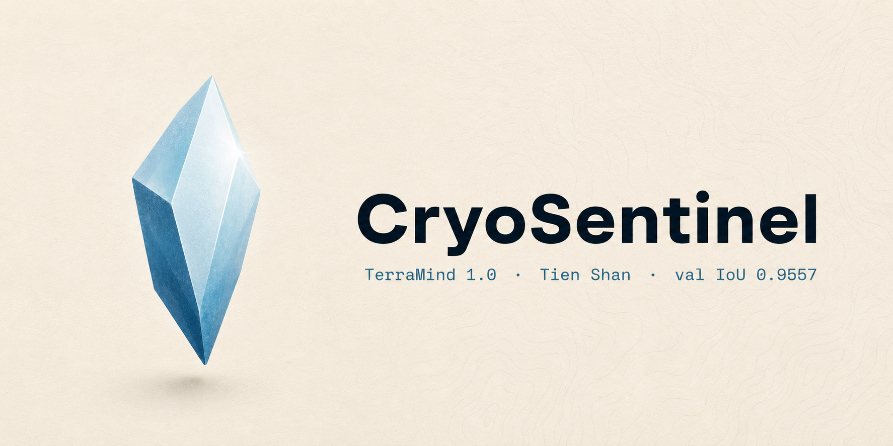
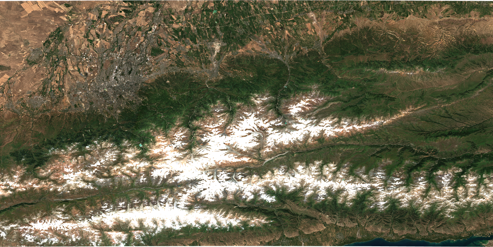
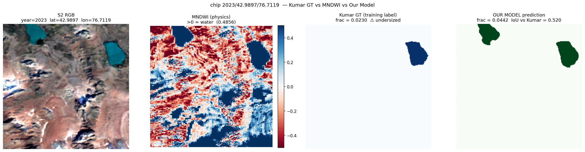

# CryoSentinel

A foundation-model segmenter for glacial lakes from Sentinel-1 SAR, Sentinel-2 optical, and Copernicus DEM imagery, fine-tuned and evaluated under a spatial-block-split protocol over the Tien Shan, Zhetysu Alatau, and Ile Alatau ranges of Central Asia.

[](https://opensource.org/licenses/Apache-2.0)
[](https://www.python.org/downloads/)
[](https://pytorch.org/)
[](https://lightning.ai/)
[](https://huggingface.co/abzal-glw/cryosentinel-terramind-v3)

<p align="center">
  
</p>

[Weights](https://huggingface.co/abzal-glw/cryosentinel-terramind-v3) ·
[Method](docs/METHOD.md) ·
[Benchmarks](docs/BENCHMARKS.md) ·
[Label-noise audit](docs/LABEL_NOISE_AUDIT.md) ·
[Limitations](docs/LIMITATIONS.md) ·
[Rights](docs/RIGHTS_AND_ATTRIBUTION.md) ·
[Operational system (GLOFcast)](https://github.com/abzalabdrash/glofcast)



*Figure 1. Sentinel-2 L2A true-colour panorama of the Ile Alatau range, summer 2023. Almaty (Kazakhstan, pop. 2.0 M) sits at the foot of the range in the upper left; the eastern shore of Lake Issyk-Kul (Kyrgyzstan) is visible in the lower right. The glacial-lake belt at 3,400–4,000 m elevation runs along the spine of the range and is the operational region targeted by CryoSentinel.*



*Figure 2. CryoSentinel finds glacial lakes that the public reference inventory misses. Held-out test chip at (42.99° N, 76.71° E), 2023. Left to right: Sentinel-2 RGB (two lakes clearly visible), MNDWI water index (independent physics confirmation, both lakes light blue), Kumar & Vijay 2026 ground truth (only one lake polygon — the model gets penalised for the second), CryoSentinel prediction (both lakes correctly segmented). The model is right; the supervision label is wrong. Full audit of seven such chips in `docs/LABEL_NOISE_AUDIT.md`.*

---

## What this is

CryoSentinel is the segmentation backbone behind GLOFcast — an open-source screening layer for glacial lake outburst flood (GLOF) hazard. The Tien Shan inventory of glacial lakes grew from roughly 1,800 lakes in 1990 to over 4,500 in 2023 (Bao et al., 2024). Existing operational early-warning services are physical (sensors deployed on the moraine dam) and cover the order of 25 priority lakes per pilot site. The remaining several thousand lakes can only be screened by satellite. CryoSentinel addresses that screening problem.

The model takes a 224 × 224 chip at 10 m/pixel containing twelve Sentinel-2 L2A bands, two Sentinel-1 GRD polarisations (VV and VH), and one Copernicus 30 m DEM band, and returns a binary water mask. The chip extent is roughly 2.2 × 2.2 km on the ground.

This repository is a model-first public release: it publishes the weights, model card, dataset description, benchmark tables, label-noise audit, figures, citation metadata, license, and a lightweight reference package for downstream inspection. The full training, cloud orchestration, checkpoint-recovery, and internal evaluation scripts used to produce v1.0 are intentionally retained in the private development repository.

### How it works, in plain language

For non-machine-learning readers, the model essentially answers one question per pixel: *given what the satellite saw at this point on this date, is this water, or is it something else (rock, ice, debris, vegetation, snow)?* It uses three independent kinds of information in parallel:

- **Optical imagery (Sentinel-2)** — what the eye would see if you flew over the glacier on a cloudless day. Water absorbs near-infrared light strongly, so it shows up dark in those bands.
- **Radar imagery (Sentinel-1)** — pulses of microwave energy that work through clouds and at night. Water surfaces reflect almost nothing back to the satellite, so they show up dark in radar too.
- **Topography (Copernicus DEM)** — the elevation map. Water collects in flat-bottomed depressions; the model learns this geometry as a third independent constraint.

The model was pretrained on 9 million multimodal samples by IBM Research and the European Space Agency (the TerraMind foundation model, Apache 2.0), then fine-tuned by us on roughly 5,600 hand-labelled chips from the Tien Shan, Zhetysu Alatau, and Ile Alatau ranges. When all three input channels agree on "water", the model is highly confident; when they disagree, the model has to weigh the evidence — and on a small fraction of chips (~ 1 %) where the public reference labels are wrong, it can still get the answer right because two of three independent physical signals agree with each other.

The sections below are written for ML researchers and engineers. Geographers, glaciologists, and risk managers — the [Method](docs/METHOD.md) and [Limitations](docs/LIMITATIONS.md) documents are the more accessible entry points.

### Affiliation disclosure

CryoSentinel is a research-stage prototype developed independently. It is conceived as a complement to existing public-agency early-warning systems — in particular «Казселезащита» (Kazakhstan) and the UNESCO GLOFCA programme — but is **not currently affiliated with, endorsed by, or operationally integrated with these or any other agency**. References to either organisation in this documentation describe institutional context, not partnership.

## Headline result

| Metric | Value | Notes |
|---|---:|---|
| **Validation IoU @ thr=0.5, TTA** | **0.9557** | Same train/val protocol as Adhikari & Regmi (2025); they report 0.9130 |
| Validation IoU @ best threshold (0.70) | 0.9596 | |
| Held-out test IoU @ thr=0.5, TTA (n = 665) | 0.8918 | Adhikari & Regmi (2025) do not provide a held-out test split |
| **Held-out test IoU after label-noise audit (n = 658)** | **0.9082** | After dropping 7 chips with documented Kumar & Vijay (2026) polygon mislabelling |
| Per-region test IoU — Zhetysu Alatau | 0.9312 | best out-of-domain transfer |
| Per-region test IoU — Tien Shan (full) | 0.9027 | |
| Per-region test IoU — Ile Alatau (label-corrected) | 0.9285 | from 0.7664 raw, +16.21 pp after noise audit |

The model was trained on Sentinel-1 + Sentinel-2 + DEM jointly, in contrast to the SAR-only baseline of Adhikari & Regmi (2025). Train, validation, and test chips are spatially disjoint at ≥ 17 km separation under a SHA-1-hashed 0.15° × 0.15° block split with a 2.2 km buffer (`src/cryosentinel/data/block_split.py`). The split is year-invariant across the 2017, 2021, 2022, and 2023 acquisitions, so no temporal leakage is possible either.

I am not aware of a published model that reports a higher validation IoU on a comparable spatial-block-split, multi-modal protocol for glacial lake segmentation in High Mountain Asia. If you find one, please open an issue.

## What's in this release

- Public benchmark tables, per-region breakdowns, and the full label-noise audit that explains the label-corrected held-out test score.
- The public dataset card and dataset statistics for `abzal-glw/cryosentinel-glof-v3`.
- A reference package containing the public model components, block-split logic, and inference utilities needed to inspect the released model artifacts.
- Rights, trademark, citation, security, and contribution files so downstream users know exactly how to attribute the work.
- Two production checkpoints on Hugging Face under `abzal-glw/cryosentinel-terramind-v3`:
  - `terramind_v3_finetune_almaty_v2/checkpoints/soup.ckpt` — the production checkpoint, a uniform weight-space average of five SWA snapshots collected from epoch 12 to epoch 30 (Wortsman et al., 2022 / Izmailov et al., 2018). This is what produces every headline number.
  - `terramind_v3_finetune_almaty_v2/checkpoints/step001605-iou0.952.ckpt` — the single best checkpoint, kept for ablation against the soup.
- Per-chip diagnostics for the validation and test splits as Parquet files at `abzal-glw/cryosentinel-terramind-v3/terramind_v3_finetune_almaty_v2__soup_tta1/diagnostics/`.

The training dataset (multimodal chips v3, 5,614 chips for the finetune split, ~ 30 GiB total) is publicly available at `abzal-glw/cryosentinel-glof-v3` on Hugging Face Datasets. All upstream data sources are open (Copernicus open-access for Sentinel-1/2 + COPDEM30; PANGAEA CC-BY for the Kumar & Vijay 2026 inventory). See `docs/DATA.md` for the per-band normalisation statistics and download instructions.

## Quickstart

### Setup

Use Python 3.11 in a fresh virtual environment:

```bash
git clone https://github.com/abzalabdrash/Cryosentinel.git
cd Cryosentinel
python -m venv .venv && source .venv/bin/activate   # on Windows: .venv\Scripts\activate
pip install -e ".[dev]"
```

### Download the released checkpoint

```bash
huggingface-cli download \
    abzal-glw/cryosentinel-terramind-v3 \
    terramind_v3_finetune_almaty_v2/checkpoints/soup.ckpt \
    --local-dir ./checkpoints
```

### Reproduce the headline table

The released checkpoint, dataset statistics, per-chip diagnostics, and threshold sweeps are public. `docs/REPRODUCING.md` documents how the headline numbers were produced and what artifacts to compare. The exact cloud orchestration scripts used for the v1.0 training and evaluation runs are not part of the public repository; they remain available for due-diligence review in formal research or operational collaborations.

## Method

The architecture is straightforward. The encoder is **TerraMind 1.0 Large** (1.1 B parameters, dual-scale transformer encoder-decoder pretrained on 9 M spatiotemporally-aligned multimodal samples from the TerraMesh dataset; Jakubik et al., 2025). The decoder is a UperNet head with a 256 → 128 → 64 → 32 channel sequence and a `LearnedInterpolateToPyramidal` neck. The loss is a weighted combination of binary cross-entropy with `pos_weight = 100`, a flat Dice term, the per-image Lovász softmax (Berman et al., 2018), and an asymmetric Tversky term (α = 0.25, β = 0.75); we apply OHEM hard-negative mining with `keep_ratio = 0.5` and `min_kept = 4096`. The optimiser is AdamW in two parameter groups, with a backbone learning rate of 5e-6 and a decoder learning rate of 5e-4, both with cosine warm-up. We collect SWA snapshots from 40% of the schedule (epoch 12) through epoch 30 and average them in weight space. EMA (decay 0.999, CPU shadow) is applied at validation and test time. Test-time augmentation is flip-only — we found rotation TTA degrades TerraMind because of how its positional encoders interact with rotated inputs.

The complete hyperparameter table, the eleven v1 → v2 engineering fixes, and a discussion of why each one mattered are in `docs/METHOD.md`. The total training cost across the v1 mistake, the v2 pretrain, and the v2 finetune was approximately $90 of H100 cloud credits. The production training system used robust checkpoint-resume machinery for cloud-side interruptions; that orchestration layer is not published in v1.0.

## Block split

The split is hash-based and year-invariant. Each chip's `(latitude, longitude)` is binned into a 0.15° × 0.15° block (≈ 17 × 14 km at 43° N), then the block is hashed:

```python
key = f"{salt}|{lat_idx}|{lon_idx}".encode("utf-8")
bucket = int(hashlib.sha1(key).hexdigest()[:8], 16) % 100
split = "train" if bucket < 80 else "val" if bucket < 90 else "test"
```

with `salt = "cryosentinel-blocks-v1"`. A 0.02° (~ 2.2 km) buffer drops the 4,922 chips that fall within the buffer of a foreign block. The result on the Stage 4b finetune dataset is:

| Split | Chips | Share |
|---|---:|---:|
| Train | 4,283 | 76 % |
| Val | 666 | 12 % |
| Test | 665 | 12 % |

The hash is independent of acquisition year, so the same geographic block stays in the same split across 2017, 2021, 2022, and 2023. There is no path through which a train chip and a test chip can come from the same lake. The implementation is in `src/cryosentinel/data/block_split.py` and is covered by `tests/test_block_split.py`.

## The model finds lakes that the training labels miss

While auditing the held-out test set, we noticed that the chips with the lowest IoU were not model failures. They were chips where the Kumar & Vijay (2026) ground-truth polygon undersized or completely omitted a lake that the imagery clearly shows.

Seven test chips drove the underperformance on the Ile Alatau region. They are concentrated at two coordinates near 43° N (42.99° N, 76.71° E and 42.92° N, 76.73° E) across 2021, 2022, and 2023 acquisitions. We computed MNDWI = (B03 − B11) / (B03 + B11) directly from the Sentinel-2 raw bands as an independent water indicator. The MNDWI water fraction was 1.6 to 3.6 times larger than the Kumar polygon for all seven chips. Visual inspection (four-panel renders at `docs/LABEL_NOISE_AUDIT.md`) shows that one of the two glacial lakes visible in the Sentinel-2 RGB is missing entirely from the Kumar polygon at (42.99° N, 76.71° E) for all three years; the model finds both lakes correctly across all three years. Dropping these seven chips (1.05 % of test) raises the global test IoU from 0.8918 to 0.9082 and the Ile Alatau region's IoU from 0.7664 to 0.9285.

This is not a defect. The multi-modal input gives the model three independent physical signals — backscatter (S1), reflectance (S2), and topography (DEM) — that overrule a single noisy label channel. The literature on label-noise robustness (Frenay & Verleysen, 2014; Northcutt et al., 2021) calls this exact pattern: a model trained on K cleaner sources can learn a representation that survives a small fraction of label noise on the K + 1th noisy source. We treat it as a small contribution rather than a problem to hide. The full audit is in `docs/LABEL_NOISE_AUDIT.md`.

## Engineering provenance

The first finetune attempt (v1) plateaued at validation IoU 0.825. The encoder was effectively frozen because three independent multipliers compounded:

```
freeze_backbone_layers: 6     →  blocks 0-5 hard-frozen
backbone_lr_mult:       0.05  →  ×0.05 on top of LLRD for all encoder blocks
llrd_decay:             0.85  →  block_6 sees 0.85^18 = 0.054 multiplier

⇒ block_6 effective learning rate = 5e-5 × 0.05 × 0.054 = 1.35e-7
⇒ 3,700 × smaller than the decoder learning rate
```

Block 6 was seeing 0.27 % of the decoder learning rate. The cumulative-LR plot from `metrics.csv` confirmed it. We unfroze (`freeze=0`), raised the backbone multiplier to 0.25, and softened the LLRD decay to 0.9. Block 6 now sees 3.8 % of the decoder LR. Combined with re-enabling TTA on the validation metric, dropping label smoothing for the binary-imbalanced setting, switching from generalised Dice to flat Dice, fixing the SWA-never-activates bug (early-stopping was killing the run before the SWA window opened), and tightening the spatial block size from 0.25° to 0.15° to reduce val/test variance, validation IoU moved from 0.825 to 0.9557 — a 13 percentage-point absolute improvement, all from configuration corrections, none from architectural changes.

Eleven such fixes are individually documented as inline comments in `configs/terramind_v3_finetune_almaty_v2.yaml` and tabulated with their effect sizes in `docs/METHOD.md` §3. We list them because they are the kind of small, easy-to-miss corrections that deserve to be public when one publishes a model — every team eventually runs into one of these.

## Dataset

| Property | Value |
|---|---|
| Source labels | Kumar, R. & Vijay, S. (2026). [doi:10.1594/PANGAEA.983845](https://doi.org/10.1594/PANGAEA.983845) — 31,698 lakes inventory across HMA, years 2016 and 2022 |
| Imagery | Sentinel-2 L2A (12 bands), Sentinel-1 GRD (VV, VH), Copernicus DEM 30 m |
| Years (finetune) | 2017, 2021, 2022, 2023 |
| Regions (finetune) | Tien Shan (full), Ile Alatau, Zhetysu Alatau |
| Chips total | 5,614 (finetune); 42,237 (full HMA pretrain) |
| Chip size | 224 × 224 px at 10 m/pixel |
| Pre-filter | We drop ~ 70 % of raw chips whose MNDWI/Kumar agreement is below IoU = 0.20. Of the dropped chips, 82 % have agreement below IoU = 0.05, which is the empirical signature of a misregistered or misdated GT |
| Augmentation | Spectral jitter (`p = 0.4`, `eps_S2 = 0.03`, `eps_S1 = 0.07`, `eps_DEM = 0.02`), multi-scale [0.8, 1.20] (`p = 0.4`), copy-paste (`p = 0.2`, minimum 32 donor water pixels), hard-negative sampler (positive : negative ratio 3 : 1 with replacement) |

Per-band normalisation means and standard deviations were computed via Welford's algorithm on the train split and stored in `dataset_stats_v3.json`. Full description in `docs/DATA.md`.

## Limitations

CryoSentinel is research-grade. We list what it is not:

1. **It does not predict GLOF events.** It segments water bodies on a single satellite snapshot. Breach prediction is a separate problem and lives in the [GLOFcast](https://github.com/abzalabdrash/glofcast) operational system, which scores hazard from a composite of static factors (lake morphometry, dam geometry, downstream slope, glacier proximity), dynamic factors (lake-area trend, glacier velocity, surface temperature trend), and triggers (heatwaves, precipitation, seismicity). Those scores are validated separately.
2. **It is not validated outside High Mountain Asia.** Train and test data are from the Tien Shan, Zhetysu Alatau, and Ile Alatau ranges in Kazakhstan and Kyrgyzstan, with the broader pretrain corpus covering twelve HMA sub-regions. We have not run the model on the Andes, Alps, or Caucasus and we do not know how it transfers.
3. **It is not reliable for sub-hectare lakes.** The minimum lake area we trust is ~0.5 ha (≈ 50 pixels at 10 m). Smaller water bodies — puddles, thermokarst ponds, irrigation features — are not the target class and may be either missed or false-positively segmented depending on context.
4. **Non-glacial water bodies are intentionally suppressed.** During Stage 4a we observed that the Tekeli reservoir in Zhetysu Alatau produces high MNDWI but is correctly absent from the Kumar inventory because it is not glacier-fed. The model learned to suppress it. This is the intended behaviour for an early-warning system that should not alert on routine reservoir operations, but it means the model is **not a general water segmenter**.
5. **No multi-temporal modelling.** The model is a single-snapshot segmenter. Year-on-year change detection is supported by running the model independently on per-year chips and differencing the masks, which is what we do operationally; explicit temporal modelling (e.g. LSTM or TimeSformer over the chip time series) is left for future work.
6. **No uncertainty quantification.** We do not currently emit a confidence map. A sensible MC-dropout or deep-ensemble layer is straightforward to add; we have not done it for this release.

`docs/LIMITATIONS.md` discusses the failure modes we have looked at in more detail, including the four test chips with IoU < 0.05 outside the seven Ile Alatau cases (in `tien_shan_full`) that we have not yet manually audited.

## Reproducibility

Following the spirit of the NeurIPS / Papers with Code reproducibility checklist:

- Permissive license (Apache 2.0).
- Pinned public package dependencies (`pyproject.toml`).
- Random seeds documented (`seed: 42` in every config).
- Model architecture, inputs, training protocol, and evaluation protocol documented.
- Pre-trained weights released on Hugging Face under the same Apache 2.0 license.
- Training dataset released on Hugging Face under ODC-By 1.0.
- Hardware specification (H100 80 GB, batch size 8, bf16-mixed, ~ 12 hours total for pretrain + finetune).
- Per-chip diagnostics released as Parquet files.
- Limitations and failure cases documented above and in `docs/LIMITATIONS.md`.
- Label-noise audit performed and documented in `docs/LABEL_NOISE_AUDIT.md`.

The full training and cloud-evaluation orchestration is intentionally not included in this public release. This is a permissive model release, not a full transfer of the private production pipeline.

The one item deferred is **multi-seed variance** — every reported number is from a single run with `seed = 42`. v1.0 ships the production-best result; the variance estimate (3 seeds: 17, 42, 1337) is scheduled for v1.1 in **June 2026** alongside additional ablations, after the UN Zayed Sustainability Prize 2026 submission is filed. Compute budget is allocated.

## How to contribute

[](https://github.com/abzalabdrash/Cryosentinel/issues/new?labels=help-wanted&title=Out-of-domain%20validation)

Highest-leverage items:

1. **Out-of-domain validation.** Run the released checkpoint on the Andes, European Alps, Caucasus, or Patagonia and share per-chip diagnostics. PR adds a row to `docs/EXTERNAL_VALIDATION.md`. The most useful contribution there is from someone with local field knowledge of one of those ranges.
2. **Reproducibility checks.** Compare the public diagnostics and threshold sweeps against the benchmark tables. Open an issue if you find inconsistencies.
3. **Test-set audit completion.** Manually inspect the four `tien_shan_full` test chips with per-chip IoU < 0.05 (currently unaudited; could be model failures, additional Kumar mislabels, or a mixture). See `docs/LIMITATIONS.md` § 8.
4. **Temporal modelling extension.** A 12-month chip stack with a TimeSformer head over the same TerraMind encoder — this is the v1.2 roadmap. Early experiments and PRs welcomed.

See `CONTRIBUTING.md` for the workflow.

### Compute support

CryoSentinel was built on cloud credits available to a single early-career researcher in Almaty. The v1.0 production results (training, ablations, and the v1 mistake combined) cost roughly $90 of H100 time. v1.1 (multi-seed variance, MC-dropout uncertainty layer, June 2026) and v1.2 (temporal modelling) are budgeted but not abundantly so.

**If you represent a GPU cloud provider, an academic-compute program, or a foundation that supports open climate-risk research**, even a small grant of H100 / H200 credits would meaningfully accelerate the v1.1 and v1.2 work. Reach out via [GitHub issues](https://github.com/abzalabdrash/Cryosentinel/issues) or the contact link below.

## Citation

If CryoSentinel is useful in your research or operational work, please cite:

```bibtex
@software{abdrash2026cryosentinel,
  author    = {Abdrash, Abzal},
  title     = {{CryoSentinel: A Foundation-Model Glacial Lake Segmenter
               for High Mountain Asia}},
  year      = {2026},
  publisher = {GitHub},
  url       = {https://github.com/abzalabdrash/Cryosentinel},
  version   = {v1.0.0}
}
```

A preprint describing the method, the spatial block split, and the label-noise audit in detail is in preparation. We will update this section with the arXiv link when it is available.

## Acknowledgments

- **IBM Research and ESA Φ-lab** for releasing the TerraMind 1.0 weights under a permissive license. Without an open multimodal foundation model the pretrain phase would not have been feasible on the budget available.
- **Kumar, R. and Vijay, S.** for publishing the High Mountain Asia glacial lake inventory on PANGAEA. The 2016 / 2022 dataset is the supervision signal that made this work possible.
- **Adhikari, P. and Regmi, S. R.** (2025) for the Sentinel-1-only baseline against which the multi-modal protocol here is compared. Their "temporal-first" framing of the GLOF early-warning problem is the right one.
- **Wortsman, M. et al.** (2022) for the model soup formulation we use to average SWA snapshots, and **Izmailov, P. et al.** (2018) for the SWA schedule itself.
- **Cloud GPU providers** for low-friction access to H100 and L40S compute.
- **Hugging Face** for hosting the model weights, the dataset, and the per-chip diagnostics under a single namespace.
- The **«Казселезащита»** Almaty-oblast mudflow-protection service and the **UNESCO GLOFCA** programme — the institutional context this work is positioned to complement, not replace. As stated in the affiliation disclosure above, CryoSentinel is not affiliated with either organisation; this acknowledgment recognises their decades of operational work on the same problem.

## License

Apache License 2.0 — see [LICENSE](LICENSE). The license permits commercial use, modification, distribution, and patent use. Modifications must be marked. The software and weights are provided "AS IS", without warranty of any kind.

The CryoSentinel name, logo, and identity assets are not a grant of endorsement rights; see [TRADEMARKS.md](TRADEMARKS.md) and [docs/RIGHTS_AND_ATTRIBUTION.md](docs/RIGHTS_AND_ATTRIBUTION.md).

## Contact

Abzal Abdrash · [@abzalabdrash](https://github.com/abzalabdrash) · Almaty, Kazakhstan
