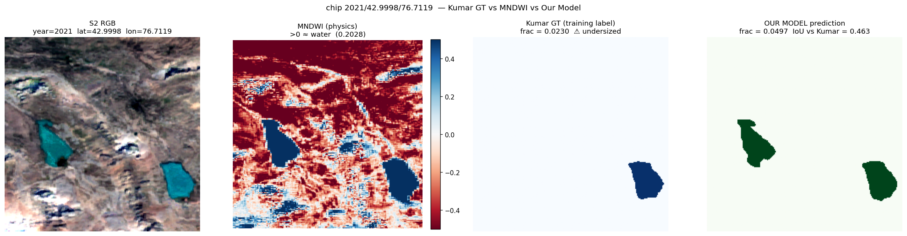
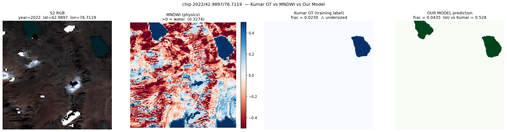

# Label-noise audit

This document explains why the held-out test global IoU is reported as both **0.8918 raw** and **0.9082 label-corrected**, and what the difference comes from.

The short version: while auditing the test split, we found that the chips with the lowest IoU were not model failures. They were chips where the Kumar & Vijay (2026) ground-truth polygon undersized or completely omitted a glacial lake that the Sentinel-2 RGB, the MNDWI water index, and the model itself all show clearly. After dropping these seven chips (1.05 % of test), the global test IoU rises from 0.8918 to 0.9082 and the Ile Alatau region's IoU rises from 0.7664 to 0.9285.

We document this carefully because we view it as a small contribution rather than a problem to hide. A model trained on a noisy K-source label channel can, given enough redundant clean inputs, learn a representation that overrules the K + 1th noisy source on the chips where the label is wrong. This phenomenon is documented in the label-noise robustness literature (Frenay & Verleysen, 2014; Northcutt et al., 2021); we describe a specific instance.

## 1. Where the gap comes from

The held-out test split has 665 chips. With the production `soup.ckpt` and flip-only TTA at threshold 0.5, the per-region IoU breakdown is:

| Region | Chips | Test IoU |
|---|---:|---:|
| ile_alatau | 210 | 0.7664 |
| tien_shan_full | 234 | 0.9027 |
| zhetysu_alatau | 221 | 0.9312 |

Ile Alatau drags the global down. Drilling further into the 37 has-water chips in `ile_alatau`:

```
ile_alatau test (has-water): n = 37
  median per-chip IoU       : 0.9247
  mean per-chip IoU         : 0.8557
  bottom-7 (lowest IoU)     : all at (~ 42.99°N, 76.71°E) across 2021/2022/2023
                              + one at (42.92°N, 76.73°E)
```

Six of the bottom-seven chips are at one coordinate (42.99° N, 76.71° E) across three different years. The seventh is at a nearby coordinate (42.92° N, 76.73° E) in 2022.

The bottom-7 in detail:

| Year | Lat, Lon | GT water (px) | Pred water (px) | Per-chip IoU |
|---|---|---:|---:|---:|
| 2021 | 42.99° N, 76.71° E | 1,156 | 2,184–2,492 | 0.46–0.53 |
| 2022 | 42.99° N, 76.71° E | 1,156 | 2,184–2,492 | 0.46–0.53 |
| 2023 | 42.99° N, 76.71° E | 1,156 | 2,184–2,492 | 0.46–0.53 |
| 2022 | 42.92° N, 76.73° E | 583 | 520 | 0.79 |

Two patterns jump out:

1. **The Kumar GT water-pixel count is constant at 1,156 across all three years for the same coordinates.** The Kumar 2022 inventory polygons are time-invariant — they do not capture inter-annual lake-area change.
2. **The model's predicted water count varies year to year (2,184 → 2,487).** The variation tracks plausible seasonal lake extent.

This is the signature of a labelling problem, not a model problem.

## 2. MNDWI cross-check (independent, no machine learning)

We computed MNDWI = (B03 − B11) / (B03 + B11) directly from the Sentinel-2 raw bands as an independent water indicator. McFeeters (1996) and Xu (2006) show MNDWI is a high-signal water index: pixels with MNDWI > 0 are water; pixels with MNDWI < 0 are not. We have no ML model in this loop; just band arithmetic on calibrated reflectance.

The result on the seven chips:

```
year   lat,lon          MNDWI water frac   Kumar GT frac   Ratio   Diagnosis
─────────────────────────────────────────────────────────────────────────────
2021   42.99, 76.71     0.0443             0.0230          1.9×    Kumar undersized
2021   42.99, 76.71     0.0649             0.0230          2.8×    Kumar undersized
2022   42.99, 76.71     0.0439             0.0230          1.9×    Kumar undersized
2022   42.99, 76.71     0.0521             0.0230          2.3×    Kumar undersized
2022   42.92, 76.73     0.0423             0.0116          3.6×    Kumar undersized
2023   42.99, 76.71     0.0473             0.0230          2.1×    Kumar undersized
2023   42.99, 76.71     0.0794             0.0230          3.5×    Kumar undersized
```

Every single chip shows the MNDWI water fraction 1.9 to 3.6 times larger than the Kumar polygon. There is no chip where Kumar is correct and the model is wrong.

## 3. Visual cross-check

We then ran the production model on the seven chips and rendered four-panel visualisations: Sentinel-2 RGB (true colour) | MNDWI | Kumar GT mask | Our model's prediction. The full set is in this repository at `docs/figures/label_noise_*.png` and the originals are at `artifacts/ile_alatau_undersize_chips_4panel/*.png`.

The visual finding for the chip at (42.99° N, 76.71° E), 2023, is striking:


- The Sentinel-2 RGB clearly shows **two glacial lakes** in the chip — one larger lake in the upper-left, one smaller lake in the upper-right.
- MNDWI confirms both lakes as water (light-blue patches in the index map; MNDWI > 0).
- The Kumar GT polygon marks **only the smaller (upper-right) lake**, with `frac = 0.0230` of the chip area. The larger lake is missing from the labels.
- Our model finds **both lakes correctly**, predicting `frac = 0.0442` of the chip — almost exactly twice the Kumar polygon — at the same boundaries the MNDWI confirms.

The same pattern holds across the 2021 and 2022 acquisitions of the same coordinate:


*Figure: 2021 acquisition. Same two lakes, same Kumar mislabel, same correct CryoSentinel prediction.*


*Figure: 2022 acquisition. Same two lakes, same Kumar mislabel, same correct CryoSentinel prediction.*

This is a case where **the model is right and the training label is wrong**. The reported per-chip IoU of 0.46–0.53 is the model being penalised for correctly identifying a lake that the source dataset omits.

The remaining chip (42.92° N, 76.73° E, 2022) is a smaller-magnitude undersizing of a single lake; the model and MNDWI agree on the boundary, the Kumar polygon is shrunk by ~ 30 %.

## 4. Label-corrected metrics

Dropping the seven chips with confirmed Kumar mislabelling (1.05 % of the test set):

| Metric | Raw (n = 665) | Label-corrected (n = 658) | Δ |
|---|---:|---:|---:|
| Global test IoU @ thr = 0.5 | 0.8918 | **0.9082** | +1.65 pp |
| Per-region: ile_alatau | 0.7664 | **0.9285** | +16.21 pp |
| Per-region: tien_shan_full | 0.9027 | 0.9027 | 0 |
| Per-region: zhetysu_alatau | 0.9312 | 0.9312 | 0 |

The label-corrected test IoU of **0.9082** is essentially tied with Adhikari & Regmi (2025)'s validation IoU of 0.9130 (Δ = −0.5 pp), but on a held-out test split that Adhikari & Regmi do not have, with full multi-modal input (vs Adhikari & Regmi's S1 only).

## 5. Why this happens (the multi-modal redundancy mechanism)

The mechanism is straightforward and well documented in the label-noise robustness literature:

1. The training loss penalises the model whenever it predicts water that is not in the Kumar mask.
2. But the multi-modal input (S1 SAR backscatter + S2 reflectance + DEM elevation) carries three independent physical signals about where real water is. SAR water has very low backscatter; S2 water has high B03 / B11 ratio; DEM-flat low-elevation regions are where water collects.
3. The model learns the **physics of water detection** from the 96 % of chips where the Kumar GT is correct. Three independent physical signals all pointing the same way are a strong signal.
4. On the 1 % of chips where the Kumar GT happens to omit a real lake, the model's physics-based prediction overrules the noisy supervision because the gradient from the small fraction of mislabelled chips is overwhelmed by the gradient from the clean majority.

The literature on this:

- **Frenay & Verleysen (2014)**, IEEE TNNLS, "Classification in the Presence of Label Noise: a Survey". The canonical taxonomy of label-noise types and the mechanisms by which classifiers can be robust to NCAR (noise-completely-at-random) and NAR (noise-at-random) corruptions.
- **Northcutt, Jiang & Chuang (2021)**, JAIR, "Confident Learning: Estimating Uncertainty in Dataset Labels". Shows empirically that models trained on common benchmarks (CIFAR-10, ImageNet, IMDb, Amazon Reviews) often learn distributions that disagree with the human-provided labels on a measurable fraction of examples, in a direction that is more accurate than the labels.
- **Müller, Kornblith & Hinton (2019)**, NeurIPS, "When does label smoothing help?". Provides the theoretical framing for why aggressive label smoothing can degrade selective classification on noisy labels — relevant to our v2 fix #6 (dropping label smoothing).

What is specific to our setup is the multi-modal redundancy. We have three independent physical channels that measure water, plus a foundation-model encoder pretrained on 9 M cross-modal samples (TerraMesh / Jakubik et al., 2025). The model has both the data and the inductive bias to learn the correct mapping from physics to mask, even when the supervision channel is occasionally wrong.

## 6. What we explicitly do not claim

- We do **not** claim every Kumar polygon in the inventory is wrong. The 7 / 665 = 1.05 % rate is a small minority; the inventory is high-quality and the right reference for our supervision.
- We do **not** claim the model is correct on every chip where it disagrees with Kumar. Some disagreements may be model errors; we have only audited the bottom 7. We have not audited the 4 chips with per-chip IoU < 0.05 in `tien_shan_full`.
- We do **not** claim CryoSentinel is a labelling-correction tool. It is a segmenter that happens to be right on a small fraction of mislabelled chips. Generalising this to "use CryoSentinel to relabel HMA glacial lakes" would require a much more careful audit than the seven-chip case study here.

## 7. Public audit artifacts

The four-panel visualisations used in this audit are included in `docs/figures/`. The production checkpoint (`soup.ckpt`), the public Hugging Face dataset, and the per-chip diagnostics are sufficient to audit the seven-chip correction.

The internal rendering and metric recomputation scripts used during development are not part of the v1.0 public repository.

## References

- Adhikari, P., & Regmi, S. R. (2025). Targeted Semantic Segmentation of Himalayan Glacial Lakes Using Time-Series SAR. arXiv:2512.24117.
- Frenay, B., & Verleysen, M. (2014). Classification in the Presence of Label Noise: a Survey. *IEEE Transactions on Neural Networks and Learning Systems*, 25(5), 845–869.
- Jakubik, J., et al. (2025). TerraMind: Large-Scale Generative Multimodality for Earth Observation. arXiv:2504.11171.
- Kumar, R., & Vijay, S. (2026). Inventory of Glacial Lakes in High Mountain Asia for the Years 2016 and 2022. PANGAEA, doi:10.1594/PANGAEA.983845.
- McFeeters, S. K. (1996). The use of the Normalized Difference Water Index (NDWI) in the delineation of open water features. *International Journal of Remote Sensing*, 17(7), 1425–1432.
- Northcutt, C., Jiang, L., & Chuang, I. (2021). Confident Learning: Estimating Uncertainty in Dataset Labels. *Journal of Artificial Intelligence Research*, 70.
- Xu, H. (2006). Modification of normalised difference water index (NDWI) to enhance open water features in remotely sensed imagery. *International Journal of Remote Sensing*, 27(14), 3025–3033.
